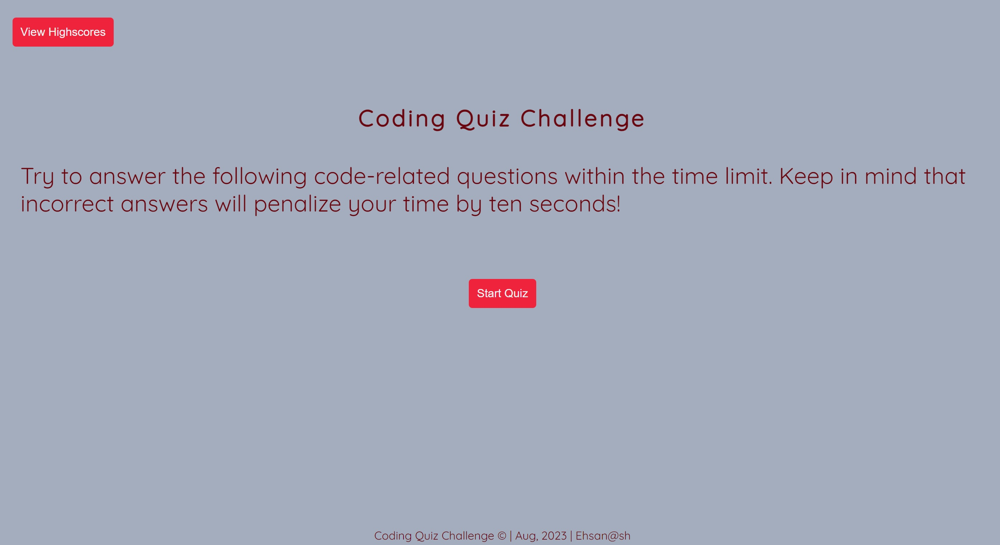

# CODING QUIZ

## _Interactive JavaScript Quiz Application:_
### _Evaluate Your Coding Skills Under the Clock_

---

## Badges

---
## Description

>This application is designed to test your coding knowledge with a set of 8 different questions. With a time limit set to 80 seconds, it creates a challenging and engaging environment to demonstrate your skills and see how quickly you can answer the questions.

>As you navigate through the quiz, the application provides immediate feedback on your answers, marking them as either correct or incorrect. This interactive element is designed to help you learn and understand the correct answers as you go along.

>Upon completing the quiz, the application will prompt you to enter your initials. This, along with your final score, is then stored and displayed in the application, allowing you to track your progress over time or even compete with friends.

>The Coding Quiz App is a fun and effective way to learn, test your knowledge, and improve your coding skills under a time pressure.

---

## Features

- **Interactive Quiz:** The application presents a set of 8 coding-related questions in an interactive format that engages the user effectively.
- **Timer Functionality:** The quiz is time-bound, with an 80-second countdown that creates a challenging environment, promoting quick thinking and faster response times.
- **Immediate Feedback:** For every question answered, the app instantly provides feedback on the correctness of the answer, promoting real-time learning.
- **Score Tracking:** The quiz keeps track of the score, rewarding correct answers and deducting for incorrect ones, providing a comprehensive evaluation of your performance.
- **Initials Input:** At the end of the quiz, you can enter your initials, allowing personalized tracking of high scores.
- **High Scores Storage:** The application saves your high scores locally, allowing you to track your progress over time, compete with others, and strive for improvement.
- **High Scores Display:** The saved high scores are displayed in an organized list format, adding to the user-friendly experience of the app.
- **Restart and Clear options:** The application also provides options to restart the quiz or clear the saved high scores, providing flexibility for repeat usage.

---

## Installation
### N/A

---
## Usage

*Just use the link provided at the bottom, click the start button and follow the questions and instructions*

---

## Credits

*Followed Websites*

[W3Schools](https://www.w3schools.com/js/default.asp)
[W3Schools](https://www.w3schools.com/js/js_htmldom.asp)
[Udemy](https://www.udemy.com/)

---

## Live URL

[EhsanAsh](https://ehsanash.github.io/code-quiz/)